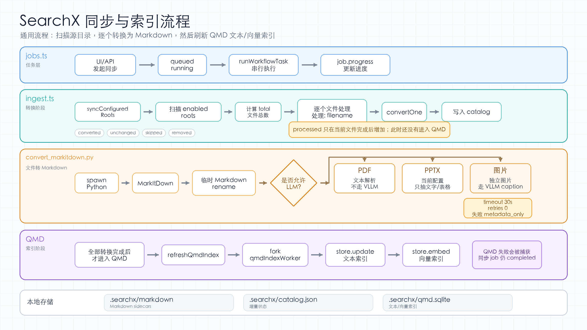

# SearchX

SearchX is a local-first natural language search system for documents and media.
It converts source files into Markdown with Microsoft MarkItDown, then indexes the
generated Markdown with QMD for BM25, vector search, fast hybrid search, and
deep natural-language reranking.



## Current shape

- API: Node.js 22 HTTP server with no web framework.
- Converter: Python worker using `markitdown`.
- Search: `@tobilu/qmd` SDK over a local SQLite index.
- Client: lightweight demo web app served by the API. Real integrations should
  use the API or CLI directly.
- Storage: `.searchx/markdown`, `.searchx/catalog.json`, `.searchx/qmd.sqlite`.
- Source files are treated as read-only. SearchX never writes Markdown into the
  original data directories.

## Install

```bash
npm install
python -m venv .venv
.venv/bin/python -m pip install -r requirements.txt
```

On Windows, use `.venv\Scripts\python.exe -m pip install -r requirements.txt`
and set `SEARCHX_PYTHON=.venv\Scripts\python.exe` when running the API.

QMD downloads local GGUF models on first vector or deep search use. SearchX
builds a vector index during sync by default, so the demo's natural-language
search works after ingestion. See [QMD local models](#qmd-local-models) for the
default models, cache location, and multilingual overrides.

## Run

```bash
npm run dev
```

Open `http://127.0.0.1:7310`.

If you installed Python dependencies into `.venv`, export `SEARCHX_PYTHON` first
or copy `.env.example` to `.env` and adjust it for your shell.

## Docker deployment on Ubuntu 22.04

SearchX can run as a single Docker Compose service. The image includes Node.js
22, Python, MarkItDown, LibreOffice, Poppler, ffmpeg, Tesseract OCR, and CJK
fonts. On Linux, Office/PPT previews are rendered by converting the first page
or slide through LibreOffice and Poppler; images and PDFs are streamed directly.

On the Ubuntu host:

```bash
git clone <this-repo-url> searchx
cd searchx
cp .env.docker.example .env.docker
mkdir -p searchx-data
```

Edit `.env.docker` and point `SEARCHX_FILES_DIR` at the host directory you want
to search:

```dotenv
SEARCHX_FILES_DIR=/home/ubuntu/files
SEARCHX_STATE_DIR=./searchx-data
SEARCHX_PORT=7310
```

Build and start:

```bash
docker compose --env-file .env.docker build
docker compose --env-file .env.docker up -d
docker compose --env-file .env.docker logs -f searchx
```

Open `http://<server-ip>:7310`, go to configuration, add `/data` as the source
folder, then start sync. The container sees your host `SEARCHX_FILES_DIR` as
read-only `/data`. SearchX writes catalog data, Markdown mirrors, previews,
SQLite indexes, and downloaded QMD models into `SEARCHX_STATE_DIR`.

If the state directory is not writable by the container user, fix ownership on
the host:

```bash
sudo chown -R 1000:1000 searchx-data
```

For an Intel Ultra 5-225H machine with 32 GB RAM, the Docker defaults are set to
safe CPU mode:

```dotenv
QMD_FORCE_CPU=1
QMD_LLAMA_GPU=false
```

The first sync or deep search may download several GB of QMD GGUF models into
`searchx-data/cache/qmd/models`, so keep the state directory on a disk with
enough free space. For Chinese or mixed-language corpora, consider the Qwen
embedding override in `.env.docker.example`, then rebuild vectors:

```bash
docker compose --env-file .env.docker exec searchx node dist/src/cli.js index --embed --force
```

If you run a local OpenAI-compatible VLM/LLM service on the Ubuntu host, point
MarkItDown to it with `host.docker.internal`:

```dotenv
OPENAI_BASE_URL=http://host.docker.internal:11434/v1
OPENAI_API_KEY=local
SEARCHX_LLM_MODEL=qwen2.5vl:7b
SEARCHX_MARKITDOWN_USE_LLM=1
```

Optional Docling PDF fallback is disabled by default to keep the image smaller.
Enable it by setting `INSTALL_DOCLING=1` before building and
`SEARCHX_DOCLING_ENABLED=1` at runtime.

## CLI

Build once, then call the CLI from `dist`:

```bash
npm run build
npm run cli -- status
npm run cli -- root add "/path/to/data" --no-recursive
npm run cli -- sync
npm run cli -- search "payment terms" --mode deep --limit 10
```

Useful CLI notes:

- `sync`, `ingest`, and `index` build QMD vector indexes by default.
- Use `--no-embed` to refresh Markdown and BM25 text search without generating
  vectors.
- Use `--force` with `sync` or `index` to rebuild embeddings after changing the
  embedding model.
- `npm run cli -- serve` starts the API server after `npm run build`.

## Workflow

1. Add one or more local data directories in the web app, API, or CLI.
2. Click `Sync`.
3. The server scans the configured roots, converts supported files, and writes
   Markdown sidecars under `.searchx/markdown/<root-id>/<relative-source-path>.md`.
4. Removed source files are removed from the catalog and their Markdown sidecars
   are deleted on the next sync.
5. Search with keywords, semantic vector search, fast natural-language search,
   or deep natural-language search.

## API

- `GET /api/health`
- `GET /api/roots`
- `POST /api/roots` with `{ "path": "...", "name": "...", "recursive": true }`
- `DELETE /api/roots/:id`
- `GET /api/assets`
- `GET /api/assets/:id/raw`
- `GET /api/assets/:id/markdown`
- `POST /api/ingest` with `{ "path": "...", "recursive": true, "embed": true }`
- `POST /api/sync` with `{ "rootIds": ["..."], "embed": true }`
- `POST /api/sync/jobs` with `{ "rootIds": ["..."], "embed": true }`
- `GET /api/jobs/:id`
- `POST /api/index` with `{ "embed": true, "force": false }`
- `POST /api/search` with `{ "query": "...", "mode": "lex|vector|hybrid|deep", "limit": 10 }`
- `GET /api/settings`
- `PUT /api/settings`

`/api/ingest`, `/api/sync`, and `/api/sync/jobs` default to `"embed": true`
unless `SEARCHX_QMD_EMBED_ON_INGEST=0` is set. Pass `"embed": false` when you
only want Markdown conversion and keyword search.

Example API flow:

```bash
curl -s -X POST http://127.0.0.1:7310/api/roots \
  -H 'Content-Type: application/json' \
  -d '{"path":"/path/to/data","recursive":true}'

curl -s -X POST http://127.0.0.1:7310/api/sync/jobs \
  -H 'Content-Type: application/json' \
  -d '{"embed":true}'

curl -s http://127.0.0.1:7310/api/jobs/<job-id>

curl -s -X POST http://127.0.0.1:7310/api/search \
  -H 'Content-Type: application/json' \
  -d '{"query":"上周关于产品的PPT文件","mode":"deep","limit":10}'
```

`GET /api/assets/:id/raw` is disabled by default because it streams original
local files. Set `SEARCHX_ALLOW_RAW_FILE_ACCESS=1` to enable it for trusted
clients.

## Local-first model policy

SearchX has two independent model paths:

- MarkItDown LLM/VLM providers extract multimodal content into Markdown.
- QMD local GGUF models index and search the generated Markdown.

SearchX exposes four query modes:

- `lex`: BM25 keyword search, no model.
- `vector`: semantic vector search with the local embedding model.
- `hybrid`: fast keyword + vector fusion, without query expansion or rerank.
- `deep`: QMD `search()` with local query expansion and rerank, best quality but
  slowest.

The demo web app maps its `Natural language` option to deep search. SearchX
does not pass the full sentence to QMD blindly: it first extracts hard signals
such as time (`上周`, `最近 7 天`, explicit dates), file type (`PPT`, `PDF`,
images, audio, video, archives), and filename/path terms. Those catalog and
Markdown exact matches are merged with QMD semantic results, so queries like
`上周关于产品的PPT文件`, `内容有麦克风的pdf`, or `开会白板图片` can combine
filters with content intent.

Deep search runs in a separate worker process with a default timeout of 30s
(`SEARCHX_DEEP_SEARCH_TIMEOUT_MS`) and reranks at most 16 candidates by default
(`SEARCHX_DEEP_SEARCH_CANDIDATE_LIMIT`). If the local model path is too slow,
SearchX kills the worker and falls back to fast hybrid search so the API and web
app do not stay stuck in "searching" forever.

Set `SEARCHX_QMD_EMBED_ON_INGEST=0`, or pass `"embed": false` / `--no-embed`,
to refresh only the text index and skip vector indexing.

### QMD local models

QMD runs local GGUF embedding, reranking, and query-expansion models through
`node-llama-cpp`; these are not OpenAI-compatible HTTP providers. SearchX sets
`XDG_CACHE_HOME` to `.searchx/cache` by default, so QMD models are cached under
`.searchx/cache/qmd/models` unless you override `XDG_CACHE_HOME`.

QMD auto-downloads its default Hugging Face GGUF models on first use:

| Model | Purpose | Approx. size |
| --- | --- | --- |
| `embeddinggemma-300M-Q8_0` | Vector embeddings | 300 MB |
| `qwen3-reranker-0.6b-q8_0` | Deep-search reranking | 640 MB |
| `qmd-query-expansion-1.7B-q4_k_m` | Deep-search query expansion | 1.1 GB |

The first `sync`, `ingest`, or `index` with embedding enabled may download the
embedding model. The first `deep` search may also download the reranker and
query-expansion models.

Override QMD model URIs with environment variables before indexing:

```bash
# Better multilingual/CJK embedding recall than the default English-oriented model.
QMD_EMBED_MODEL=hf:Qwen/Qwen3-Embedding-0.6B-GGUF/Qwen3-Embedding-0.6B-Q8_0.gguf

# Optional overrides. Leave empty to use QMD defaults.
QMD_RERANK_MODEL=hf:...
QMD_GENERATE_MODEL=hf:...
```

After changing `QMD_EMBED_MODEL`, rebuild vectors because embeddings from
different models are not compatible:

```bash
npm run cli -- index --embed --force
```

Useful runtime knobs:

- `QMD_LLAMA_GPU=auto|metal|vulkan|cuda|false`
- `QMD_FORCE_CPU=1`
- `SEARCHX_QMD_UPDATE_TIMEOUT_MS=120000`
- `SEARCHX_QMD_EMBED_TIMEOUT_MS=1800000`
- `SEARCHX_DEEP_SEARCH_TIMEOUT_MS=30000`
- `SEARCHX_DEEP_SEARCH_CANDIDATE_LIMIT=16`

SearchX is MarkItDown-first: it does not expose VLM, OCR, or ASR switches in the
demo UI. Content extraction goes through MarkItDown, and optional models should
be exposed as MarkItDown LLM/VLM providers or plugins. SearchX defaults to
best-effort extraction: MarkItDown plugins, archive handling, and media handling
are enabled unless explicitly disabled by environment variables.

MarkItDown runs without model calls unless an OpenAI-compatible provider is
configured. To let MarkItDown use a local or cloud endpoint, set:

```bash
OPENAI_BASE_URL=http://127.0.0.1:8000/v1
OPENAI_API_KEY=local
SEARCHX_LLM_MODEL=openbmb/MiniCPM-V-4.6
```

When `OPENAI_BASE_URL` and `SEARCHX_LLM_MODEL` are set, SearchX enables the
provider automatically. If `OPENAI_API_KEY` is omitted for a local provider, the
converter passes a dummy `local` key to satisfy OpenAI-compatible clients. Set
`SEARCHX_MARKITDOWN_USE_LLM=0` to force model calls off.

Use `SEARCHX_MARKITDOWN_LLM_EXTENSIONS` to limit which source file types receive
the MarkItDown LLM/VLM client. For faster PPTX ingestion, keep this list to
standalone image extensions so PowerPoint text and tables are still parsed, but
embedded slide images are not sent through VLM captioning. When using
`llama.cpp` multimodal servers, prefer JPEG/PNG; its `libmtmd` helper decodes
data-URI image bytes through `stb_image`, so formats such as WebP/HEIC/AVIF can
surface server logs like `mtmd_helper_bitmap_init_from_buf: failed to decode
image bytes` unless they are normalized first.

```bash
SEARCHX_MARKITDOWN_LLM_EXTENSIONS=.jpg,.jpeg,.png
```

Set `SEARCHX_LLM_TIMEOUT_SEC` and `SEARCHX_LLM_MAX_RETRIES` to keep unstable
local VLM calls from blocking a sync run on one image:

```bash
SEARCHX_LLM_TIMEOUT_SEC=30
SEARCHX_LLM_MAX_RETRIES=0
```

In MarkItDown 0.1.6 as installed here:

- Plain document conversion does not require a model.
- Image descriptions and PPTX image captions use an OpenAI-compatible vision
  model when the source extension is allowed by
  `SEARCHX_MARKITDOWN_LLM_EXTENSIONS`.
- `markitdown-ocr` uses the same vision model for embedded-image OCR in PDF,
  DOCX, PPTX, and XLSX files.
- Audio transcription currently uses `speech_recognition` with Google
  recognition; a local-first production pipeline should replace this with a
  local ASR engine such as Whisper or faster-whisper.

### Optional Docling PDF fallback

SearchX can use Docling as a slow, high-quality PDF fallback while keeping
MarkItDown as the default fast converter. This is useful for scanned PDFs,
licenses, certificates, and image-heavy PDFs where MarkItDown extracts little or
no text.

Install Docling only when you need this path:

```bash
.venv/bin/python -m pip install -r requirements-docling.txt
```

Then enable the fallback:

```bash
SEARCHX_DOCLING_ENABLED=1
SEARCHX_DOCLING_EXTENSIONS=.pdf
SEARCHX_DOCLING_MODE=fallback
SEARCHX_DOCLING_MIN_MARKITDOWN_CHARS=200
SEARCHX_DOCLING_TIMEOUT_MS=180000
SEARCHX_CONVERTER_TIMEOUT_MS=240000
SEARCHX_DOCLING_CACHE_DIR=.searchx/cache/docling/hf
DOCLING_DEVICE=cpu
DOCLING_NUM_THREADS=4
```

With `fallback` mode, SearchX first runs MarkItDown. Docling is invoked only
when the source extension is allowed and the MarkItDown output is shorter than
`SEARCHX_DOCLING_MIN_MARKITDOWN_CHARS`. If Docling fails or times out, the
MarkItDown result is kept and the error is recorded in the Markdown sidecar.
Keep `SEARCHX_CONVERTER_TIMEOUT_MS` higher than `SEARCHX_DOCLING_TIMEOUT_MS` so
the outer Node converter timeout does not fire before Docling can return.
Docling model downloads are cached under `SEARCHX_DOCLING_CACHE_DIR` by default.
Use `DOCLING_DEVICE=cpu` by default on Apple Silicon because Docling's current
standard PDF layout path can fail on MPS with float64 tensor operations.

## Notes

The web app is a demo and validation client. The intended integration surface is
the API and CLI, so other applications or agents can add roots, sync, inspect
jobs, rebuild indexes, and search without depending on the browser UI.

## License

SearchX is released under the MIT License. See [LICENSE](LICENSE).
